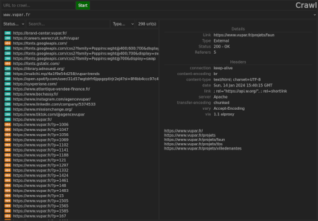

# Crawl

This is a web crawler, based on nodejs. There are 2 parts :

-   a crawler, that can be run by itself in a terminal, and generate sqlite reports
-   a client UI, which can perform crawls too, and inspect report files



## Install

```sh
# clone project
$ git clone https://github.com/Amund/crawl.git

# copy .env from template, then edit it to configure
$ cp .env.template .env

# start docker, and server
$ make up
```

## Usage

Navigate to `https://localhost:3001` (or wathever you have in `.env`)
